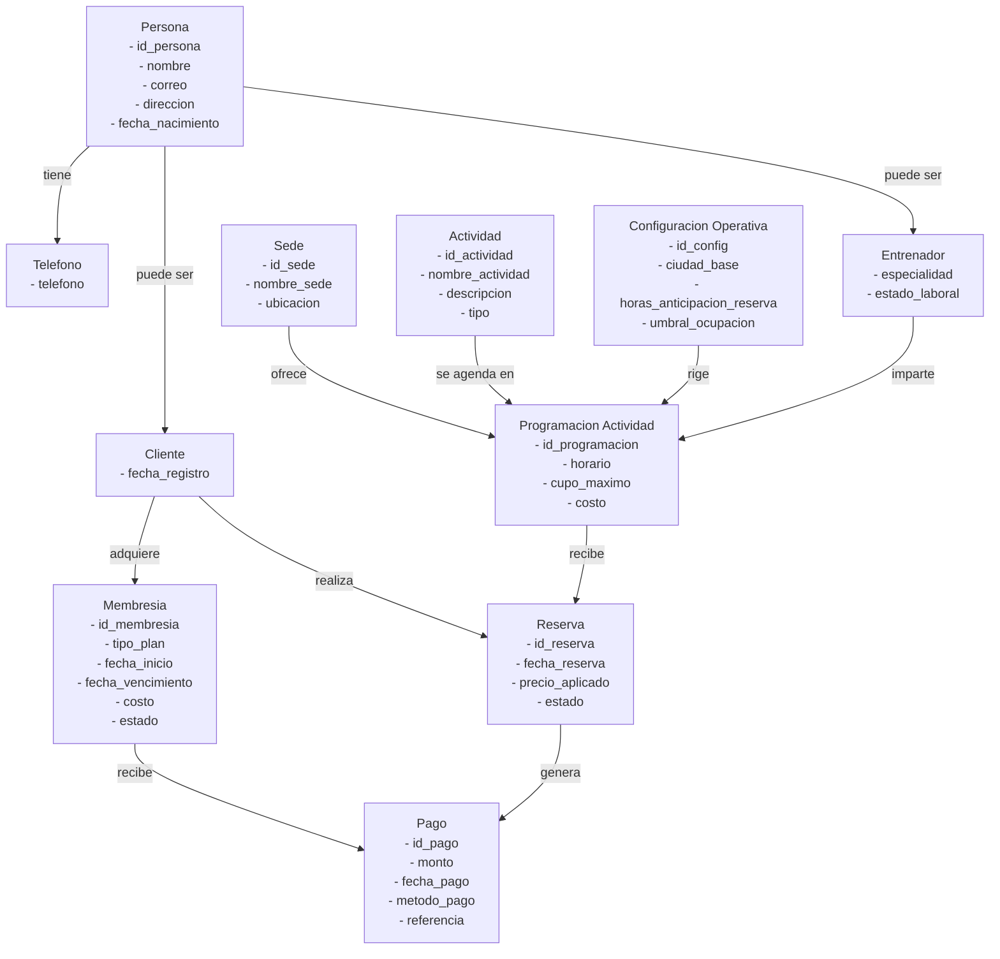
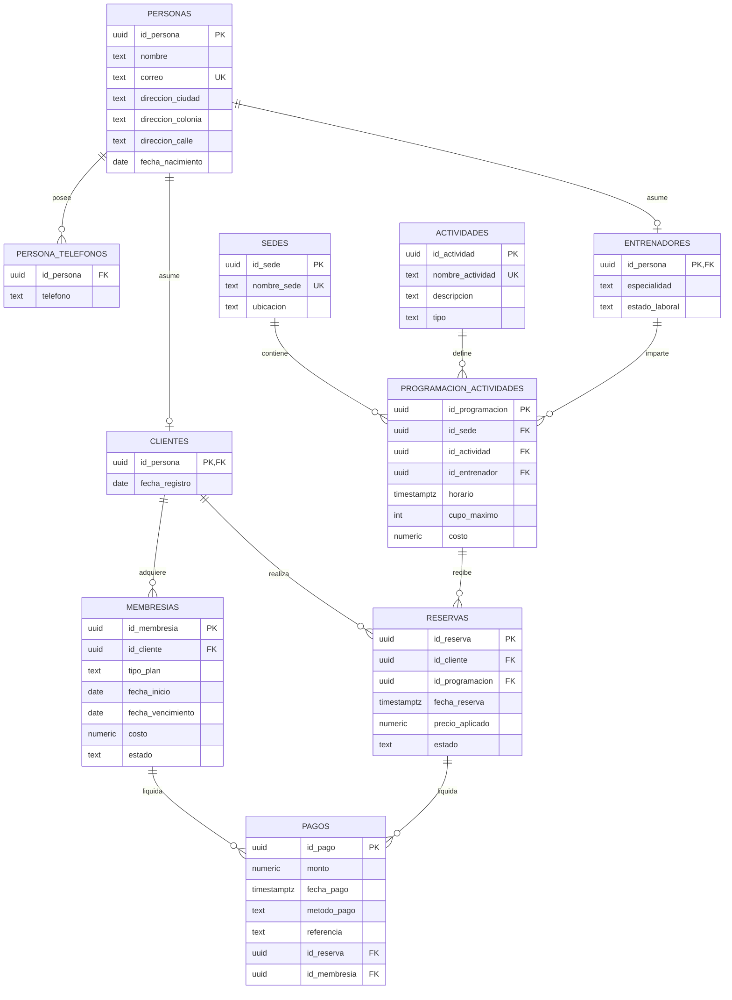

# FitHub Modelos

Este archivo deja una base exportable para los entregables visuales. Puedes abrirlo en un visor compatible con Mermaid y exportarlo a PDF o imagen.

## Modelo Conceptual

## Modelo Logico

## Observaciones de diseño

- Generalizacion: `personas` se especializa en `clientes` y `entrenadores`.
- Entidad asociativa: `reservas` conecta clientes con actividades programadas.
- Atributo compuesto: direccion dividida en ciudad, colonia y calle.
- Atributo multivaluado: `persona_telefonos` modela telefonos separados de `personas`.
- PK compuesta recomendada para entrega final formal: `(id_persona, telefono)` en `persona_telefonos` si deseas enfatizar el multivaluado en la defensa escrita.